```python
from __future__ import print_function

import numpy as np
import scipy as sc
import pandas as pd
import seaborn.apionly as sns

from matplotlib import pyplot as plt
from matplotlib import cm
from matplotlib import rc
from matplotlib import font_manager
from matplotlib import gridspec
from cycler import cycler 
from phdwork.commons.utils import plot_class_means

np.random.seed(1337)  # for reproducibility
%matplotlib inline
```

    Using Theano backend.


```python
from keras.datasets import mnist
from keras.utils import np_utils

# input image dimensions
img_rows, img_cols, img_channels,  = 28, 28, 1
input_shape=(img_rows, img_cols, img_channels)

# the data, shuffled and split between train and test sets
(X_train, y_train), (X_test, y_test) = mnist.load_data()

X_train = X_train.reshape(X_train.shape[0], img_rows, img_cols, img_channels)
X_test = X_test.reshape(X_test.shape[0], img_rows, img_cols, img_channels)

X_train = X_train.astype('float32')
X_test = X_test.astype('float32')
X_train /= 255
X_test /= 255

# convert class vectors to binary class matrices
nb_classes = 10
Y_train = np_utils.to_categorical(y_train, nb_classes)
Y_test = np_utils.to_categorical(y_test, nb_classes)
```


```python
plt.rcParams['lines.linewidth'] = 2
plt.rcParams['axes.prop_cycle'] = cycler('color', [cm.coolwarm(i) for i in np.linspace(0, 1, 6)])
plt.rcParams['axes.grid'] = True
plt.rcParams['axes.labelsize'] = 'medium'
plt.rcParams['axes.labelweight'] = 'normal'
plt.rcParams['axes.titlesize'] = 'medium'
plt.rcParams['axes.titleweight'] = 'normal'
plt.rcParams['font.size'] = 14
plt.rcParams['font.serif'] = 'Helvetica'
plt.rcParams['font.weight'] = 'normal'

plt.rcParams['legend.fontsize'] = 'medium'
plt.rcParams['legend.fancybox'] = True
plt.rcParams['legend.shadow'] = True
rc('legend', numpoints = 2)
rc('legend', fontsize = 'large')
```


```python
load_loc = "/Users/ozsel/git/phdwork/parentvised/MNIST/pa2_k5/c3_is_0/"

acc = np.load(load_loc + 'acc.npy')
vacc = np.load(load_loc + 'vacc.npy')
affinity = np.load(load_loc + 'affinity.npy')
balance = np.load(load_loc + 'balance.npy')
coactivity = np.load(load_loc + 'coactivity.npy')
activation = np.load(load_loc + 'activation.npy')
indmax = acc[:,-1].argmax(axis=0)
indmin = acc[:,-1].argmin(axis=0)

load_loc = "/Users/ozsel/git/phdwork/parentvised/MNIST/pa2_k5/c3_is_1e-6_after_ep2/"

acc2 = np.load(load_loc + 'acc.npy')
vacc2 = np.load(load_loc + 'vacc.npy')
affinity2 = np.load(load_loc + 'affinity.npy')
balance2 = np.load(load_loc + 'balance.npy')
coactivity2 = np.load(load_loc + 'coactivity.npy')
activation2 = np.load(load_loc + 'activation.npy')
indmax2 = acc2[:,-1].argmax(axis=0)
indmin2 = acc2[:,-1].argmin(axis=0)
```


```python
overwrite = False
```

## Parentvised k=5


```python
a=np.linspace(0, 1, 9)
rc('axes', prop_cycle=cycler('color', [cm.Set1(i) for i in a]))

bin_size=300

ind_1 = (activation2[0:60000,].argmax(axis=1)==0).reshape(60000*44)

fig = plt.figure(figsize=(12,3))

ax1 = fig.add_subplot(111)


for i in range(5):
    foo = activation2[0:60000,].swapaxes(1,2).reshape(60000*44,10)
    ax1.hist(foo[ind_1,i*2], bin_size, normed=True,histtype='bar', alpha=0.7, zorder=5-i,  
             label='Cluster-'+str(i+1),edgecolor = 'none')
    
ax1.set_xlabel('Activation', fontsize=16)
ax1.set_xlim(-4,8)
ax1.set_ylim(0,1)
ax1.set_yticks([0, .25, .5, .75, 1])
ax1.set_ylabel('Probability', fontsize=16)

plt.legend(fontsize=12)
if overwrite:
    fig.savefig('../../Ph.D/2017 - ICML/figures/acti-1.pdf', format='pdf', bbox_inches='tight')
```


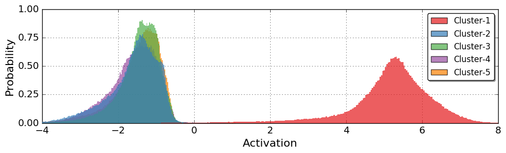


```python
bin_size=300
ind_2 = (activation2[0:60000,].argmax(axis=1)%2==0).reshape(60000*44)

fig = plt.figure(figsize=(12,3))
ax2 = fig.add_subplot(111)

for i in range(5):
    foo = activation2[0:60000,].swapaxes(1,2).reshape(60000*44,10)
    ax2.hist(foo[ind_2,i*2], bin_size, normed=True,histtype='bar', alpha=0.7, zorder=5-i,
             label='Cluster-' + str(i+1),edgecolor = 'none')

ax2.set_xlabel('Activation', fontsize=16)
ax2.set_xlim(-4,8)
ax2.set_yticks([0, .25, .5, .75, 1])
ax2.set_ylabel('Probability', fontsize=16)

plt.legend(fontsize=12)
if overwrite:
    fig.savefig('../../Ph.D/2017 - ICML/figures/acti-2.pdf', format='pdf', bbox_inches='tight')
```


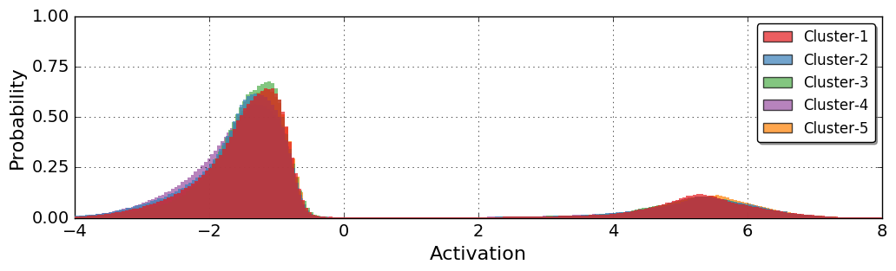


```python
a=np.linspace(0, 1, 5)
rc('axes', prop_cycle=cycler('color', [cm.coolwarm(i) for i in a]))

b=np.linspace(0.05, 0.95, 5)
b[2] = 0.6

bin_size = 100
```


```python
load_loc = "/Users/ozsel/git/phdwork/MNIST/pa2_k5/during_ep1/"

affinity_during_ep1 = np.load(load_loc + 'affinity.npy')
balance_during_ep1 = np.load(load_loc + 'balance.npy')
coactivity_during_ep1 = np.load(load_loc + 'coactiviy.npy')
```


```python
fig = plt.figure(figsize=(12,3))

x = np.linspace(0,1,coactivity_during_ep1.shape[0])

ax1 = fig.add_subplot(131)
line11, = ax1.plot(x, balance_during_ep1, linewidth=3, color=cm.coolwarm(b[0]), label="$c_3 = 0$", zorder = 10)

ax2 = fig.add_subplot(132)
line21, = ax2.plot(x, affinity_during_ep1, linewidth=3, color=cm.coolwarm(b[0]), label="$c_3 = 0$", zorder = 10)

ax3 = fig.add_subplot(133)
line31, = ax3.plot(x, coactivity_during_ep1, linewidth=3, color=cm.coolwarm(b[0]), label='$c_3 = 0$', zorder = 10)

ax1.set_yticks([0,.25,.50,.75,1])
ax1.set_ylim(0.,1)
ax1.set_ylabel('Balance', fontsize=14)
ax1.set_xlim(0,1)
ax1.set_xticks([0,1])
ax1.set_xlabel('Epochs', fontsize=14)

ax2.set_yticks([0,.05,.10,.15,.2])
ax2.set_ylim(0,0.2)
ax2.set_ylabel('Affinity', fontsize=14)
ax2.set_xlim(0,1)
ax2.set_xticks([0,1])
ax2.set_xlabel('Epochs', fontsize=14)

ax3.set_yticks([0,12500,25000,37500,50000])
ax3.set_ylim(0,50000)
ax3.set_ylabel("Coactivity",fontsize=14)
ax3.set_xlim(0,1)
ax3.set_xticks([0,1])
ax3.set_xlabel('Epochs', fontsize=14)

fig.subplots_adjust(wspace=.4)
if overwrite:
    fig.savefig('../../Ph.D/2017 - ICML/figures/metrics-2c-5k-e1.pdf', format='pdf', bbox_inches='tight')
```


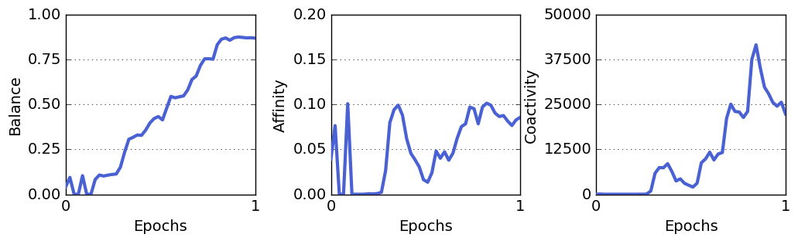


```python
fig = plt.figure(figsize=(12,3))

ax1 = fig.add_subplot(131)
sns.tsplot(data=np.stack((balance,balance2),axis=-1), time=range(1,51), 
            color=cm.coolwarm([b[0],b[4]]), ci=[95], alpha=1)

ax2 = fig.add_subplot(132, sharex=ax1)
sns.tsplot(data=np.stack((affinity,affinity2),axis=-1), time=range(1,51), 
           color=cm.coolwarm([b[0],b[4]]), ci=[95], alpha=1)

ax3 = fig.add_subplot(133, sharex=ax1)
sns.tsplot(data=np.stack((coactivity,coactivity2),axis=-1), time=range(1,51),
           color=cm.coolwarm([b[0],b[4]]), ci=[95], alpha=1, condition=["$c_3 = 0$","$c_3 > 0$ if $ep>2$"])

ax1.set_yticks([0.6,.7,.8,.9,1])
ax1.set_ylim(0.6,1)
ax1.set_ylabel('Balance', fontsize=14)
ax1.set_xlim(1,50)
ax1.set_xticks([1,10,20,30,40,50])
ax1.set_xlabel('Epochs', fontsize=14)

ax2.set_yticks([0,.01,.02,.03,.04])
ax2.set_ylim(0,0.04)
ax2.set_ylabel('Affinity', fontsize=14)
ax2.set_xlim(1,50)
ax2.set_xticks([1,10,20,30,40,50])
ax2.set_xlabel('Epochs', fontsize=14)

ax3.set_yticks([0,500,1000,1500,2000])
ax3.set_ylim(0,2000)
ax3.set_ylabel("Coactivity",fontsize=14)
ax3.legend(loc='upper right', fontsize=16)
ax3.set_xlim(1,50)
ax3.set_xticks([1,10,20,30,40,50])
ax3.set_xlabel('Epochs', fontsize=14)

fig.subplots_adjust(wspace=.4)
if overwrite:
    fig.savefig('../../Ph.D/2017 - ICML/figures/metrics-2c-5k-e2.pdf', format='pdf', bbox_inches='tight')
```


```python
fig = plt.figure(figsize=(12,3))
# and the first axes using subplot populated with data 
ax1 = fig.add_subplot(111)

sns.tsplot(np.stack((acc,acc2),axis=-1),time=range(1,51), condition=["$c_3 = 0$","$c_3 > 0$ if $ep>2$"],
            color=cm.coolwarm([b[0],b[4]]), ax=ax1)
sns.tsplot(np.stack((acc,acc2),axis=-1), time=range(1,51), 
            color=cm.coolwarm([b[1],b[3]]), ax=ax1, estimator=np.max)
sns.tsplot(np.stack((acc,acc2),axis=-1),time=range(1,51), 
            color=cm.coolwarm([b[1],b[3]]), ax=ax1, estimator=np.min)

plt.xlim(1,50)
plt.ylim(.80,1)
plt.xticks([1,10,20,30,40,50])

plt.xlabel('Epochs', fontsize=16)
plt.ylabel('Clustering Accuracy', fontsize=16)
plt.legend(loc='center right', fontsize=12)
if overwrite:
    fig.savefig('../../Ph.D/2017 - ICML/figures/acc-2c-5k-e2.pdf', format='pdf', bbox_inches='tight')
```


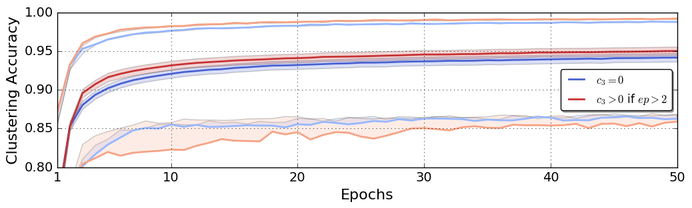


```python
fig = plt.figure(figsize=(12,3))
# and the first axes using subplot populated with data 
ax1 = fig.add_subplot(111)
area1 = ax1.fill_between(range(1,51), acc[indmax,] , acc[indmin,], 
                 alpha=0.1, zorder=-1, label='Range $c_3 = 0$')
ax1.plot(range(1,51), acc[indmax,], color=cm.coolwarm(b[1]), linewidth=2)
line1, = ax1.plot(range(1,51), acc.mean(axis=0), color=cm.coolwarm(b[0]), linewidth=3, label='$c_3 = 0$')
ax1.plot(range(1,51), acc[indmin,], color=cm.coolwarm(b[1]), linewidth=2)

ax2 = fig.add_subplot(111, sharex=ax1, sharey=ax1, frameon=False)
area2 = ax2.fill_between(range(1,51), acc2[indmax,] , acc2[indmin,], 
                 facecolor=cm.coolwarm(b[4]), alpha=0.2, zorder=-2, label='Range $c_3 > 0$ if $epoch>2$')
ax2.plot(range(1,51), acc2[indmax,], color=cm.coolwarm(b[3]), linewidth=2)
line2, = ax2.plot(range(1,51), acc2.mean(axis=0), color=cm.coolwarm(b[4]), linewidth=3, label='$c_3 > 0$ if $ep>2$')
ax2.plot(range(1,51), acc2[indmin,], color=cm.coolwarm(b[3]), linewidth=2)
#line3, = ax2.plot(range(1,51), np.ones(50)*0.74, '--', color=cm.gray(0), label='k-Means')

plt.xlim(1,50)
plt.ylim(.80,1)
plt.xticks([1,10,20,30,40,50])

plt.xlabel('Epochs', fontsize=16)
plt.ylabel('Clustering Accuracy', fontsize=16)
plt.legend(handles=[line1,line2], loc='lower right', fontsize=16)
if overwrite:
    fig.savefig('../../Ph.D/2017 - ICML/figures/acc-2c-5k-e2.pdf', format='pdf', bbox_inches='tight')
```


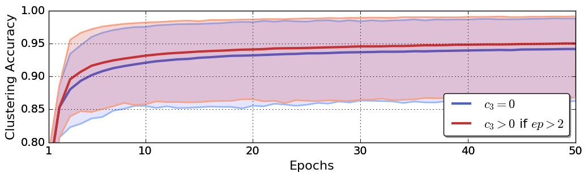


```python
fig = plt.figure(figsize=(20,8.2))

ax1 = fig.add_subplot(222)
est = activation2[0:60000,:,indmax2].argmax(axis=1)
plot_class_means(2, 5, est, X_train, transpose=True,ax=ax1)

ax2 = fig.add_subplot(224, sharex=ax1)
est = activation2[60000::,:,indmax2].argmax(axis=1)
plot_class_means(2, 5, est, X_test, transpose=True,ax=ax2)

ax3 = fig.add_subplot(221)
est = activation2[0:60000,:,indmin2].argmax(axis=1)
plot_class_means(2, 5, est, X_train, transpose=True,ax=ax3)

ax4 = fig.add_subplot(223, sharex=ax3)
est = activation2[60000::,:,indmin2].argmax(axis=1)
plot_class_means(2, 5, est, X_test, transpose=True,ax=ax4)

fig.subplots_adjust(hspace=.0)
fig.subplots_adjust(wspace=.15)

for i in range(5):
    ax1.text(4+i*28, -3, 'Cluster-'+str(i+1), fontsize=18, color = 'black')

ax1.text(-5, 8, 'Class-1', fontsize=18, color = 'black', rotation='vertical')
ax1.text(-5, 36, 'Class-2', fontsize=18, color = 'black', rotation='vertical')
ax1.text(-12, 18, 'Training Set', fontsize=18, color = 'black', rotation='vertical')
ax2.text(-5, 8, 'Class-1', fontsize=18, color = 'black', rotation='vertical')
ax2.text(-5, 36, 'Class-2', fontsize=18, color = 'black', rotation='vertical')
ax2.text(-12, 22, 'Test Set', fontsize=18, color = 'black', rotation='vertical')
ax2.text(45, 62, 'Most Accurate Clustering', fontsize=18)

for i in range(5):
    ax3.text(4+i*28, -3, 'Cluster-'+str(i+1), fontsize=18, color = 'black')

ax3.text(-5, 8, 'Class-1', fontsize=18, color = 'black', rotation='vertical')
ax3.text(-5, 36, 'Class-2', fontsize=18, color = 'black', rotation='vertical')
ax3.text(-12, 18, 'Training Set', fontsize=18, color = 'black', rotation='vertical')
ax4.text(-5, 8, 'Class-1', fontsize=18, color = 'black', rotation='vertical')
ax4.text(-5, 36, 'Class-2', fontsize=18, color = 'black', rotation='vertical')
ax4.text(-12, 22, 'Test Set', fontsize=18, color = 'black', rotation='vertical')
ax4.text(45, 62, ' Least Accurate Clustering', fontsize=18)

if overwrite:
    fig.savefig('../../Ph.D/2017 - ICML/figures/img-2c-5k-e2.pdf', format='pdf', bbox_inches='tight')
```


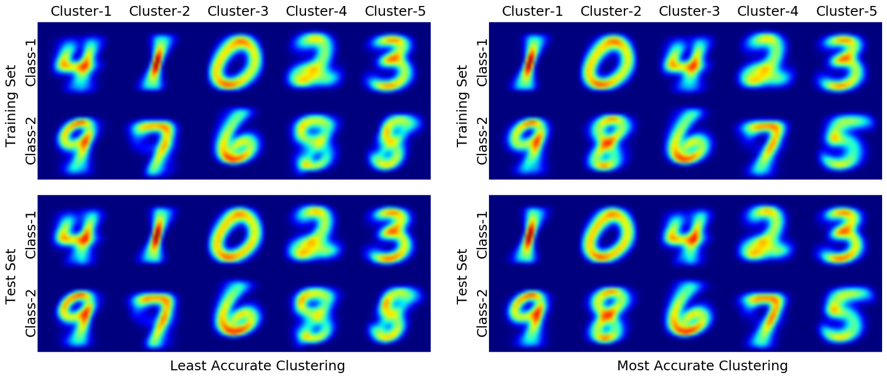


## Parentvised k=10


```python
load_loc = "/Users/ozsel/Desktop/parentvised/MNIST/pa2_k10/c3_is_0/"

acc = np.load(load_loc + 'acc.npy')
vacc = np.load(load_loc + 'vacc.npy')
affinity = np.load(load_loc + 'affinity.npy')
balance = np.load(load_loc + 'balance.npy')
coactivity = np.load(load_loc + 'coactivity.npy')
activation = np.load(load_loc + 'activation.npy')
indmax = acc[:,-1].argmax(axis=0)
indmin = acc[:,-1].argmin(axis=0)

load_loc = "/Users/ozsel/Desktop/parentvised/MNIST/pa2_k10/c3_is_1e-6_after_ep20/"

acc2 = np.load(load_loc + 'acc.npy')
vacc2 = np.load(load_loc + 'vacc.npy')
affinity2 = np.load(load_loc + 'affinity.npy')
balance2 = np.load(load_loc + 'balance.npy')
coactivity2 = np.load(load_loc + 'coactivity.npy')
activation2 = np.load(load_loc + 'activation.npy')
indmax2 = acc2[:,-1].argmax(axis=0)
indmin2 = acc2[:,-1].argmin(axis=0)
```


```python
a=np.linspace(0, 1, 10)
rc('axes', prop_cycle=cycler('color', [cm.Set1(i) for i in a]))

bin_size=300

ind_1 = (activation2[0:60000,].argmax(axis=1)==0).reshape(60000*50)

fig = plt.figure(figsize=(12,3))

ax1 = fig.add_subplot(111)


for i in range(10):
    foo = activation2[0:60000,].swapaxes(1,2).reshape(60000*50,20)
    ax1.hist(foo[ind_1,i*2], bin_size, normed=True,histtype='bar', alpha=0.7, zorder=10-i,  
             label='Cluster-'+str(i+1),edgecolor = 'none')
    
ax1.set_xlabel('Activation', fontsize=16)
ax1.set_xlim(-4,8)
ax1.set_ylim(0,1)
ax1.set_yticks([0, .25, .5, .75, 1])
ax1.set_ylabel('Probability', fontsize=16)

plt.legend(fontsize=10)
if overwrite:
    fig.savefig('../../Ph.D/2017 - ICML/figures/acti-3.pdf', format='pdf', bbox_inches='tight')
```


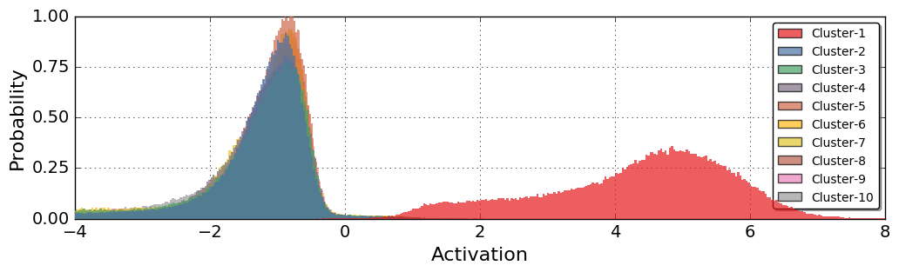


```python
bin_size=300
ind_2 = (activation2[0:60000,].argmax(axis=1)%2==0).reshape(60000*50)

fig = plt.figure(figsize=(12,3))
ax2 = fig.add_subplot(111)

for i in range(5):
    foo = activation2[0:60000,].swapaxes(1,2).reshape(60000*50,20)
    ax2.hist(foo[ind_2,i*2], bin_size, normed=True,histtype='bar', alpha=0.7, zorder=10-i,
             label='Cluster-' + str(i+1),edgecolor = 'none')

ax2.set_xlabel('Activation', fontsize=16)
ax2.set_xlim(-4,8)
ax2.set_yticks([0, .25, .5, .75, 1])
ax2.set_ylabel('Probability', fontsize=16)

plt.legend(fontsize=10)
if overwrite:
    fig.savefig('../../Ph.D/2017 - ICML/figures/acti-2.pdf', format='pdf', bbox_inches='tight')
```


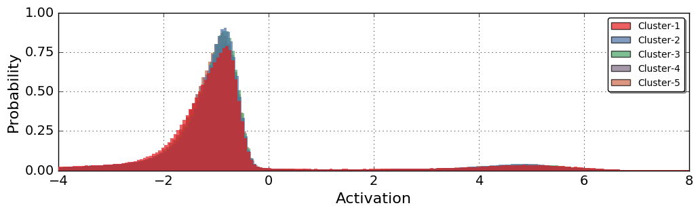


```python
a=np.linspace(0, 1, 5)
rc('axes', prop_cycle=cycler('color', [cm.coolwarm(i) for i in a]))

b=np.linspace(0.05, 0.95, 5)
b[2] = 0.6

bin_size = 100
```


```python
fig = plt.figure(figsize=(12,3))

ax1 = fig.add_subplot(131)
sns.tsplot(data=np.stack((balance,balance2),axis=-1), time=range(1,51), 
            color=cm.coolwarm([b[0],b[4]]), ci=[95], alpha=1)

ax2 = fig.add_subplot(132, sharex=ax1)
sns.tsplot(data=np.stack((affinity,affinity2),axis=-1), time=range(1,51), 
           color=cm.coolwarm([b[0],b[4]]), ci=[95], alpha=1)

ax3 = fig.add_subplot(133, sharex=ax1)
sns.tsplot(data=np.stack((coactivity,coactivity2),axis=-1), time=range(1,51),
           color=cm.coolwarm([b[0],b[4]]), ci=[95], alpha=1, condition=["$c_3 = 0$","$c_3 > 0$ if $ep>20$"])

ax1.set_yticks([0.6,.7,.8,.9,1])
ax1.set_ylim(0.6,1)
ax1.set_ylabel('Balance', fontsize=14)
ax1.set_xlim(1,50)
ax1.set_xticks([1,10,20,30,40,50])
ax1.set_xlabel('Epochs', fontsize=14)

ax2.set_yticks([0,.01,.02,.03,.04])
ax2.set_ylim(0,0.04)
ax2.set_ylabel('Affinity', fontsize=14)
ax2.set_xlim(1,50)
ax2.set_xticks([1,10,20,30,40,50])
ax2.set_xlabel('Epochs', fontsize=14)

ax3.set_yticks([0,2000,4000,6000,8000])
ax3.set_ylim(0,8000)
ax3.set_ylabel("Coactivity",fontsize=14)
ax3.legend(loc='upper right', fontsize=12)
ax3.set_xlim(1,50)
ax3.set_xticks([1,10,20,30,40,50])
ax3.set_xlabel('Epochs', fontsize=14)

fig.subplots_adjust(wspace=.4)
if overwrite:
    fig.savefig('../../Ph.D/2017 - ICML/figures/metrics-2c-10k-e20.pdf', format='pdf', bbox_inches='tight')
```


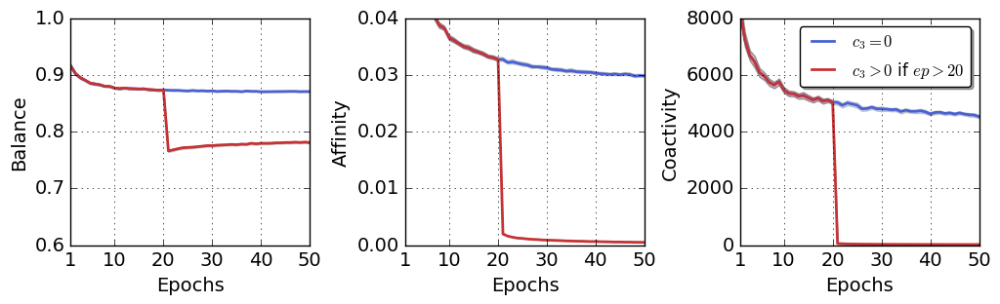


```python
fig = plt.figure(figsize=(12,3))
# and the first axes using subplot populated with data 
ax1 = fig.add_subplot(111)

sns.tsplot(np.stack((acc,acc2),axis=-1),time=range(1,51), condition=["$c_3 = 0$","$c_3 > 0$ if $ep>20$"],
            color=cm.coolwarm([b[0],b[4]]), ax=ax1)
sns.tsplot(np.stack((acc,acc2),axis=-1), time=range(1,51), 
            color=cm.coolwarm([b[1],b[3]]), ax=ax1, estimator=np.max)
sns.tsplot(np.stack((acc,acc2),axis=-1),time=range(1,51), 
            color=cm.coolwarm([b[1],b[3]]), ax=ax1, estimator=np.min)

plt.xlim(1,50)
plt.ylim(.80,1)
plt.xticks([1,10,20,30,40,50])

plt.xlabel('Epochs', fontsize=16)
plt.ylabel('Clustering Accuracy', fontsize=16)
plt.legend(loc='lower right', fontsize=16)
if overwrite:
    fig.savefig('../../Ph.D/2017 - ICML/figures/acc-2c-10k-e20.pdf', format='pdf', bbox_inches='tight')
```


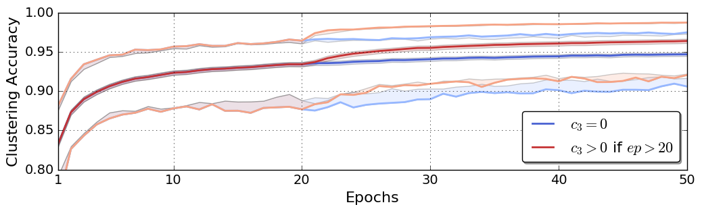


```python
fig = plt.figure(figsize=(12,3))
# and the first axes using subplot populated with data 
ax1 = fig.add_subplot(111)
area1 = ax1.fill_between(range(1,51), acc[indmax,] , acc[indmin,], 
                 alpha=0.1, zorder=-1, label='Range $c_3 = 0$')

ax1.plot(range(1,51), acc[indmax,], color=cm.coolwarm(b[1]), linewidth=2)

line1, = ax1.plot(range(1,51), acc.mean(axis=0), color=cm.coolwarm(b[0]), linewidth=3, label='$c_3 = 0$')

ax1.plot(range(1,51), acc[indmin,], color=cm.coolwarm(b[1]), linewidth=2)

ax2 = fig.add_subplot(111, sharex=ax1, sharey=ax1, frameon=False)

area2 = ax2.fill_between(range(1,51), acc2[indmax,] , acc2[indmin,], 
                 facecolor=cm.coolwarm(b[4]), alpha=0.2, zorder=-2, label='Range $c_3 > 0$ if $epoch>20$')

ax2.plot(range(1,51), acc2[indmax,], color=cm.coolwarm(b[3]), linewidth=2)

line2, = ax2.plot(range(1,51), acc2.mean(axis=0), color=cm.coolwarm(b[4]), linewidth=3, label='$c_3 > 0$ if $ep>20$')

ax2.plot(range(1,51), acc2[indmin,], color=cm.coolwarm(b[3]), linewidth=2)

#line3, = ax2.plot(range(1,51), np.ones(50)*0.74, '--', color=cm.gray(0), label='k-Means')

plt.xlim(1,50)
plt.ylim(.80,1)
plt.xticks([1,10,20,30,40,50])

plt.xlabel('Epochs', fontsize=16)
plt.ylabel('Clustering Accuracy', fontsize=16)
plt.legend(handles=[line1,line2], loc='lower right', fontsize=16)
if overwrite:
    fig.savefig('../../Ph.D/2017 - ICML/figures/acc-2c-10k-e20.pdf', format='pdf', bbox_inches='tight')
```


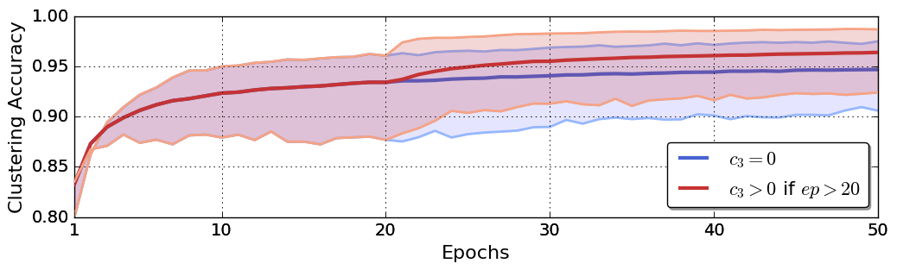


```python
fig = plt.figure(figsize=(20,8.4))
ax1 = fig.add_subplot(211)
est = activation2[0:60000,:,indmax2].argmax(axis=1)
plot_class_means(2,10,est, X_train, transpose=True, ax=ax1)
ax2 = fig.add_subplot(212, sharex=ax1)
est = activation2[60000:70000,:,indmax2].argmax(axis=1)
plot_class_means(2,10,est, X_test, transpose=True, ax=ax2)

fig.subplots_adjust(hspace=.0)

for i in range(10):
    ax1.text(5+i*28, -3, 'Cluster-'+str(i+1), fontsize=16, color = 'black')

ax1.text(-5, 9, 'Class-1', fontsize=16, color = 'black', rotation='vertical')
ax1.text(-5, 37, 'Class-2', fontsize=16, color = 'black', rotation='vertical')
ax1.text(-12, 20, 'Training Set', fontsize=16, color = 'black', rotation='vertical')
ax2.text(-5, 9, 'Class-1', fontsize=16, color = 'black', rotation='vertical')
ax2.text(-5, 37, 'Class-2', fontsize=16, color = 'black', rotation='vertical')
ax2.text(-12, 24, 'Test Set', fontsize=16, color = 'black', rotation='vertical')
if overwrite:
    fig.savefig('../../Ph.D/2017 - ICML/figures/img-2c-10k-e20.pdf', format='pdf', bbox_inches='tight')
```


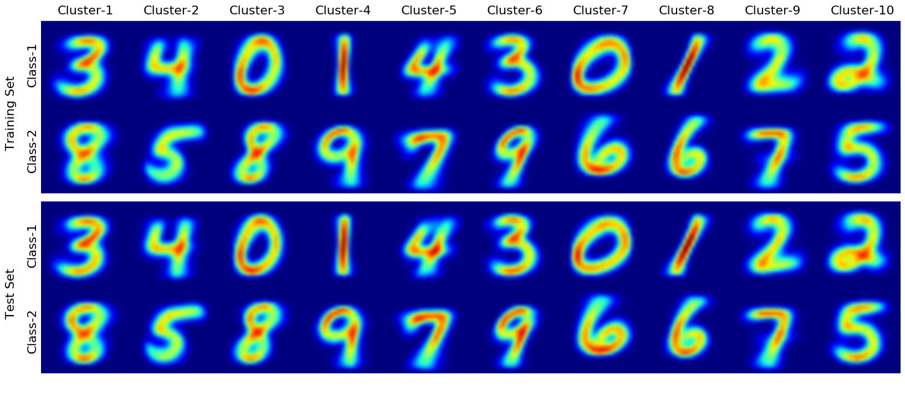

