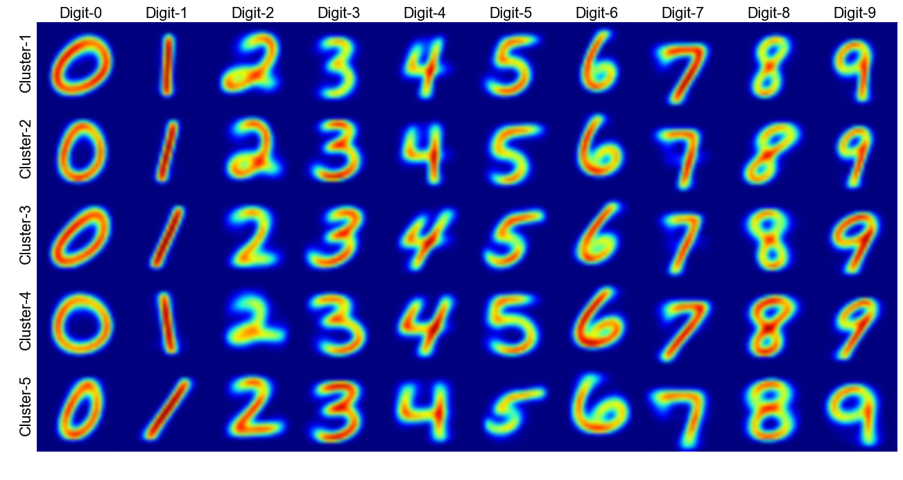
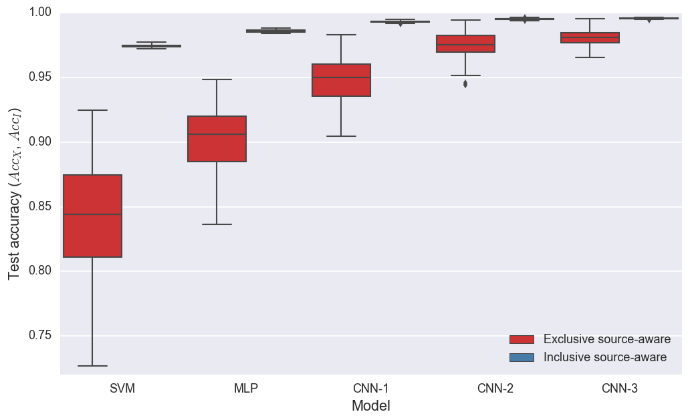
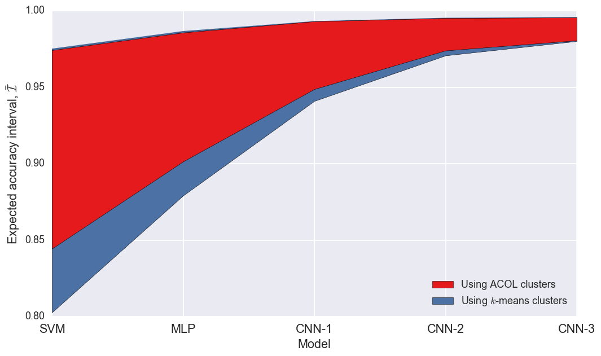
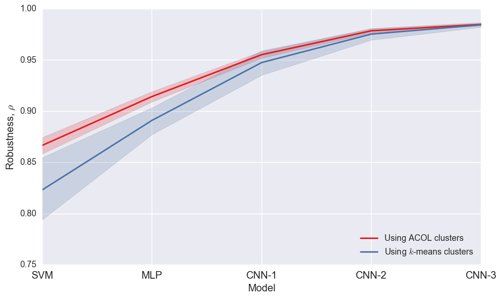
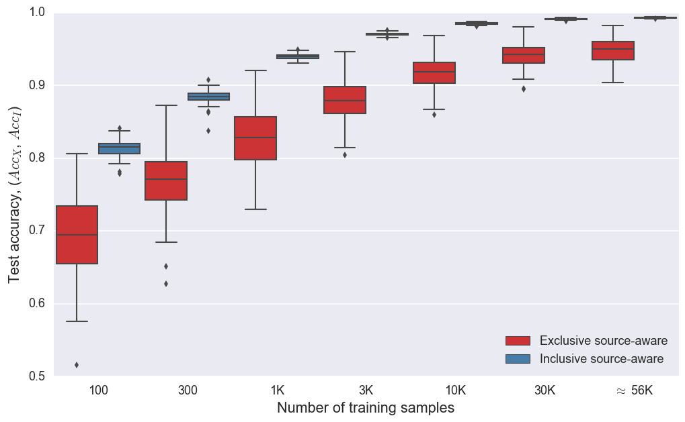
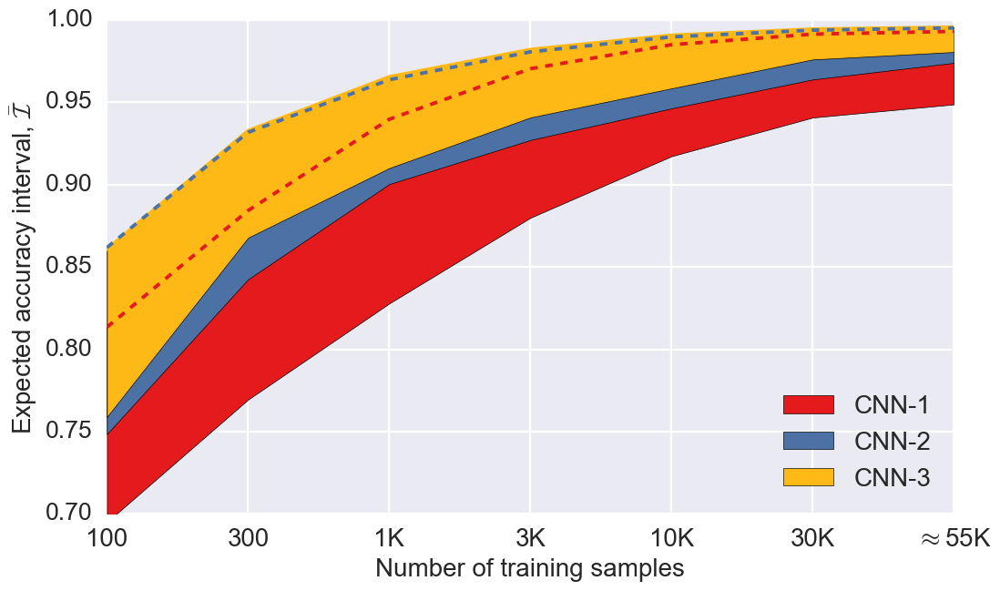
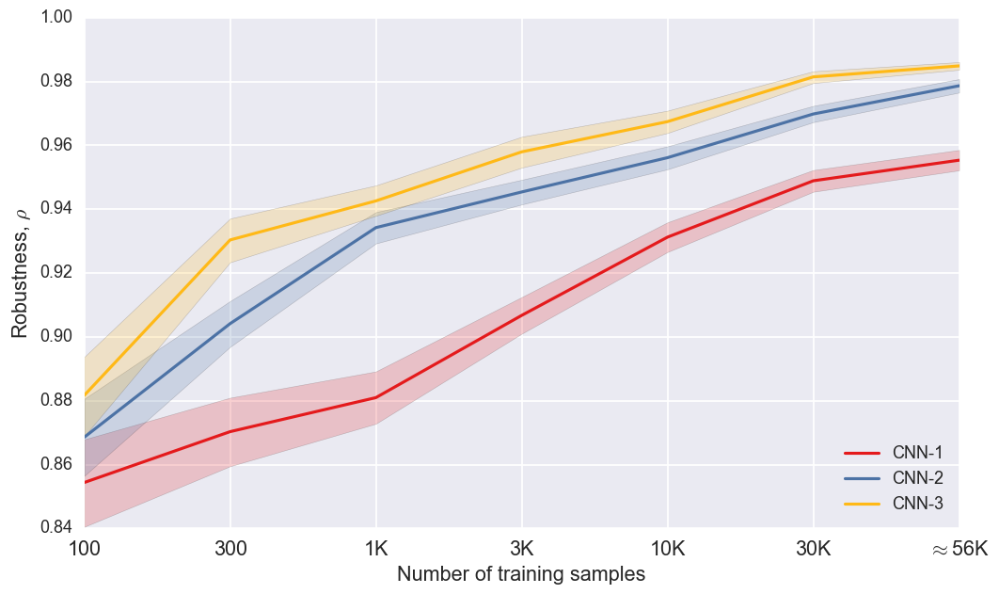
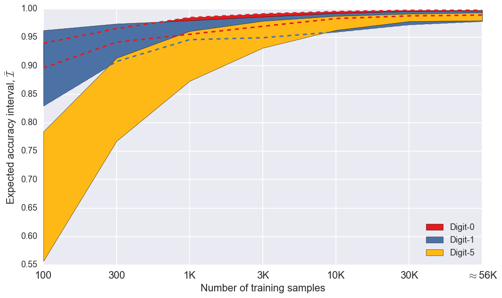
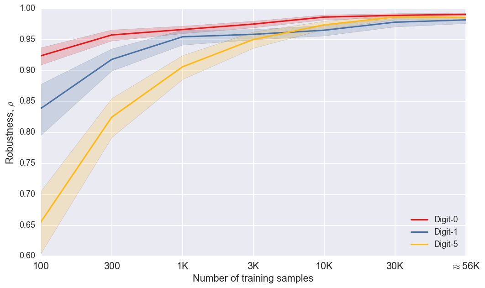

```python
from __future__ import print_function

import numpy as np
import scipy as sc
import pandas as pd
import matplotlib.pyplot as plt
import matplotlib.cm as cm
import matplotlib.gridspec as gridspec
import seaborn as sns

from phdwork.commons.utils import plot_class_means
from phdwork.robustness.metrics import robustness_constant

np.random.seed(1337)  # for reproducibility
%matplotlib inline

from cycler import cycler 

from mpl_toolkits.mplot3d import Axes3D
from matplotlib import cm
from matplotlib import rc

from matplotlib import font_manager

plt.rcParams['lines.linewidth'] = 2
plt.rcParams['axes.prop_cycle'] = cycler('color', [cm.Set1(i) for i in np.linspace(0, 1, 10)])
plt.rcParams['axes.grid'] = True
plt.rcParams['axes.labelsize'] = 'medium'
plt.rcParams['axes.labelweight'] = 'normal'
plt.rcParams['axes.titlesize'] = 'medium'
plt.rcParams['axes.titleweight'] = 'normal'
plt.rcParams['font.size'] = 14
plt.rcParams['font.serif'] = 'Helvetica'
plt.rcParams['font.weight'] = 'normal'

plt.rcParams['legend.fontsize'] = 'medium'
plt.rcParams['legend.fancybox'] = True
plt.rcParams['legend.shadow'] = True
rc('legend', numpoints = 2)
rc('legend', fontsize = 'large')

a=np.linspace(0, 1, 10)
rc('axes', prop_cycle=cycler('color', [cm.Set1(i) for i in a]))

b=np.linspace(0.00, 1, 10)

fontsize = None

sns.set(context='talk',style='darkgrid', palette='Set1', font_scale=1, rc=plt.rcParams)
```

    Using Theano backend.


```python
from keras.datasets import mnist
from keras.utils import np_utils

# input image dimensions
img_rows, img_cols, img_channels,  = 28, 28, 1
input_shape=(img_rows, img_cols, img_channels)

# the data, shuffled and split between train and test sets
(X_train, y_train), (X_test, y_test) = mnist.load_data()

X_train = X_train.reshape(X_train.shape[0], img_rows, img_cols, img_channels)
X_test = X_test.reshape(X_test.shape[0], img_rows, img_cols, img_channels)

X_train = X_train.astype('float32')
X_test = X_test.astype('float32')
X_train /= 255
X_test /= 255

# convert class vectors to binary class matrices
nb_classes = 10
Y_train = np_utils.to_categorical(y_train, nb_classes)
Y_test = np_utils.to_categorical(y_test, nb_classes)
```


```python
main_loc = "/Users/ozsel/git/phdwork/phdwork/robustness/files/"

exc_cnn_all = np.zeros((7,3,100))
k = 0
for i in [100,300, 1000, 3000, 10000, 30000, 60000]:
    for j in [1,2,3]:
        load_loc1 = main_loc + 'CNN' + str(j) + '/acc_x_' + str(i) + '.npy'
        foo = np.load(load_loc1)[:,3,:].max(axis=1)
        exc_cnn_all[k,j-1,:] = foo[np.random.permutation(foo.shape[0])][0:100]
    k += 1
    
inc_cnn_all  = np.zeros((7,3,100))
k = 0
for i in [100,300, 1000, 3000, 10000, 30000, 60000]:
    for j in [1,2,3]:
        load_loc1 = main_loc + 'CNN' + str(j) + '/acc_i_' + str(i) + '.npy'
        foo = np.load(load_loc1)[:,3,:].max(axis=1)
        inc_cnn_all[k,j-1,:] = foo[np.random.permutation(foo.shape[0])][0:100]
    k += 1
    
exc_full  = np.zeros((5,100))
exc_full[0,:] = np.load(main_loc + 'SVM/acc_x_60000.npy')
exc_full[1,:] = np.load(main_loc + 'MLP/acc_x_60000.npy')[:,3,:].max(axis=1)
exc_full[2,:] = np.load(main_loc + 'CNN1/acc_x_60000.npy')[:,3,:].max(axis=1)
exc_full[3,:] = np.load(main_loc + 'CNN2/acc_x_60000.npy')[:,3,:].max(axis=1)
exc_full[4,:] = np.load(main_loc + 'CNN3/acc_x_60000.npy')[:,3,:].max(axis=1)

inc_full  = np.zeros((5,100))
inc_full[0,:] = np.load(main_loc + 'SVM/acc_i_60000.npy')
inc_full[1,:] = np.load(main_loc + 'MLP/acc_i_60000.npy')[:,3,:].max(axis=1)
inc_full[2,:] = np.load(main_loc + 'CNN1/acc_i_60000.npy')[:,3,:].max(axis=1)
inc_full[3,:] = np.load(main_loc + 'CNN2/acc_i_60000.npy')[:,3,:].max(axis=1)
inc_full[4,:] = np.load(main_loc + 'CNN3/acc_i_60000.npy')[:,3,:].max(axis=1)

exc_full_kmeans  = np.zeros((5,10))
exc_full_kmeans[0,:] = np.load(main_loc + 'UsingKmeans/SVM/acc_x_60000.npy')
exc_full_kmeans[1,:] = np.load(main_loc + 'UsingKmeans/MLP/acc_x_60000.npy')[:,3,:].max(axis=1)
exc_full_kmeans[2,:] = np.load(main_loc + 'UsingKmeans/CNN1/acc_x_60000.npy')[:,3,:].max(axis=1)
exc_full_kmeans[3,:] = np.load(main_loc + 'UsingKmeans/CNN2/acc_x_60000.npy')[0:10,3,:].max(axis=1)
exc_full_kmeans[4,:] = np.load(main_loc + 'UsingKmeans/CNN3/acc_x_60000.npy')[:,3,:].max(axis=1)

inc_full_kmeans  = np.zeros((5,10))
inc_full_kmeans[0,:] = np.load(main_loc + 'UsingKmeans/SVM/acc_i_60000.npy')
inc_full_kmeans[1,:] = np.load(main_loc + 'UsingKmeans/MLP/acc_i_60000.npy')[:,3,:].max(axis=1)
inc_full_kmeans[2,:] = np.load(main_loc + 'UsingKmeans/CNN1/acc_i_60000.npy')[:,3,:].max(axis=1)
inc_full_kmeans[3,:] = np.load(main_loc + 'UsingKmeans/CNN2/acc_i_60000.npy')[0:10,3,:].max(axis=1)
inc_full_kmeans[4,:] = np.load(main_loc + 'UsingKmeans/CNN3/acc_i_60000.npy')[:,3,:].max(axis=1)

exc_class_cnn = np.zeros((7,100,10))
k = 0
j=3
for i in [100,300, 1000, 3000, 10000, 30000, 60000]:
    load_loc1 = main_loc + 'CNN' + str(j) + '/class_acc_x_' + str(i) + '.npy'
    exc_class_cnn[k,:,:] = np.load(load_loc1)
    k += 1
    
    
inc_class_cnn = np.zeros((7,100,10))
k = 0
for i in [100,300, 1000, 3000, 10000, 30000, 60000]:
    load_loc1 = main_loc + 'CNN' + str(j) + '/class_acc_i_' + str(i) + '.npy'
    inc_class_cnn[k,:,:] = np.load(load_loc1)[0:100,:]
    k += 1
    
inc_class_cnn[inc_class_cnn==0]=np.nan
exc_class_cnn[exc_class_cnn==0]=np.nan

rb = robustness_constant(inc_cnn_all, exc_cnn_all)
rb_model = robustness_constant(inc_full, exc_full)
rb_class = robustness_constant(inc_class_cnn, exc_class_cnn)
rb_model_kmeans = robustness_constant(inc_full_kmeans, exc_full_kmeans)

est = np.load(main_loc + '/robust_validation_est.npy')
est_kmean= np.load(main_loc + '/robust_validation_est_kmeans.npy')

overwrite = False
```


```python
fig = plt.figure(figsize=(16,8))
ax1 = fig.add_subplot(111)
plot_class_means(10,5,est, np.concatenate((X_train,X_test),axis=0), sort=True, ax=ax1)

for i in range(10):
    ax1.text(7+i*28, -2, 'Digit-' + str(i), fontsize=fontsize, color = 'black')

for i in range(5):
    ax1.text(-6, 6+i*28, 'Cluster-' + str(i+1), fontsize=fontsize, color = 'black', rotation='vertical')
    
if overwrite:
    plt.savefig('../../Ph.D/2017 - UAI/figures/clusters.pdf', format='pdf', bbox_inches='tight')
```


```python
fig = plt.figure(figsize=(16,8))
ax1 = fig.add_subplot(111)
plot_class_means(10,5,est_kmean, np.concatenate((X_train,X_test),axis=0), sort=True, ax=ax1)

for i in range(10):
    ax1.text(7+i*28, -2, 'Digit-' + str(i), fontsize=fontsize, color = 'black')

for i in range(5):
    ax1.text(-6, 6+i*28, 'Cluster-' + str(i+1), fontsize=fontsize, color = 'black', rotation='vertical')
    
if overwrite:
    plt.savefig('../../Ph.D/2017 - UAI/figures/clusters_kmeans.pdf', format='pdf', bbox_inches='tight')
```





```python
foo = np.zeros((10,100))
for i in range(5):
    foo[i*2,:] = exc_full[i,:]
    foo[i*2+1,:] = inc_full[i,:]

k = 0
df = pd.DataFrame(data=np.zeros((1000,3)),columns=['Model','Partition Type','Accuracy'])
foo_list = []
for modelType in ['SVM', 'MLP', 'CNN-1', 'CNN-2', 'CNN-3']:
    for partType in ['Exclusive source-aware', 'Inclusive source-aware']:
        foo_list = []
        model = []
        for i in range(100):
            model.append(modelType)
        partition = []
        for i in range(100):
            partition.append(partType)
            
        foo_list.append(model)
        foo_list.append(partition)
        foo_list.append(foo[k,:].T)

        df.loc[k*100:k*100+99] = map(list, zip(*foo_list))
        k += 1
        
```


```python
plt.figure(figsize=((12,7)))
ax1 = plt.subplot(111)
# Draw a nested boxplot to show bills by day and sex
sns.boxplot(x="Model", y="Accuracy", hue="Partition Type", data=df, ax=ax1,linewidth=1.5, width=.95)
sns.despine(offset=0, trim=False)

ax1.set_ylabel('Test accuracy ($Acc_X$, $Acc_I$)', fontsize=fontsize)
ax1.set_xlabel('Model', fontsize=fontsize)
ax1.set_ylim(0.72,1)
ax1.legend(loc = 'lower right', fontsize=fontsize)
if overwrite:
    plt.savefig('../../Ph.D/2017 - UAI/figures/models_acc.pdf', format='pdf', bbox_inches='tight')
```





```python
plt.figure(figsize=(12,7))
ax1 = plt.subplot(111)

ax1.fill_between(range(0,5), exc_full.mean(axis=1), 
                             inc_full.mean(axis=1), 
                             facecolor=cm.Set1(b[0]), alpha=1, zorder=3, label='Using ACOL clusters')

ax1.plot(inc_full_kmeans.mean(axis=1), '-',color=cm.Set1(b[1]),alpha=1, linewidth=1)
ax1.fill_between(range(0,5), exc_full_kmeans.mean(axis=1), 
                             inc_full_kmeans.mean(axis=1), 
                             facecolor=cm.Set1(b[1]), alpha=1, zorder=2, label='Using $k$-means clusters')

ax1.set_xlabel('Model', fontsize=fontsize)
ax1.set_xticklabels(['SVM', 'MLP', 'CNN-1', 'CNN-2', 'CNN-3'], fontsize=fontsize)
ax1.set_xticks([0,1,2,3,4])
ax1.set_ylim(0.80,1)
ax1.set_ylabel(r'Expected accuracy interval, $\mathcal{\bar{I}}$' , fontsize=fontsize)
ax1.legend(loc='lower right', fontsize=fontsize)
if overwrite:
    plt.savefig('../../Ph.D/2017 - UAI/figures/cluster_comparison_interval.pdf', format='pdf', bbox_inches='tight')
```





```python
plt.figure(figsize=(12,7))
ax1 = plt.subplot(111)

sns.tsplot(data=rb_model[:,0:100].T,color=cm.Set1(b[0]),condition='Using ACOL clusters',ci=95, alpha=1)
sns.tsplot(data=rb_model_kmeans.T,color=cm.Set1(b[1]),condition='Using $k$-means clusters',ci=95, alpha=1)
sns.despine(offset=0, trim=True)

ax1.set_xlabel('Model', fontsize=fontsize)
ax1.set_xticklabels(['SVM', 'MLP', 'CNN-1', 'CNN-2', 'CNN-3'], fontsize=fontsize)
ax1.set_xticks([0,1,2,3,4])
ax1.set_ylabel(r'Robustness, $\rho$', fontsize=fontsize)
ax1.legend(loc='lower right', fontsize=fontsize)
if overwrite:
    plt.savefig('../../Ph.D/2017 - UAI/figures/cluster_comparison.pdf', format='pdf', bbox_inches='tight')
```





```python
foo = np.zeros((14,3,100))
for i in range(7):
    for j in range(3):
        foo[i*2,j,:] = exc_cnn_all[i,j,:]
        foo[i*2+1,j,:] = inc_cnn_all[i,j,:]

k = 0
df = pd.DataFrame(data=np.zeros((1400,4)),columns=['Model','Partition Type','Number of training samples','Accuracy'])
foo_list = []
for sizeType in ['100', '300', '1K', '3K', '10K', '30K', r'$\approx$ 56K']:
    for partType in ['Exclusive source-aware', 'Inclusive source-aware']:  
        j = 0
        for modelType in ['CNN-1']:
            foo_list = []
            model = []
            for i in range(100):
                model.append(modelType)
            partition = []
            for i in range(100):
                partition.append(partType)
            size = []
            for i in range(100):
                size.append(sizeType)
                
            foo_list.append(model)
            foo_list.append(partition)
            foo_list.append(size)
            foo_list.append(foo[k,j,:].T)
        df.loc[k*100:k*100+99] = map(list, zip(*foo_list))
        k += 1
        
```


```python
plt.figure(figsize=((12,7)))
ax1 = plt.subplot(111)
# Draw a nested boxplot to show bills by day and sex

sns.boxplot(x="Number of training samples", y="Accuracy", hue="Partition Type", data=df, ax=ax1, linewidth=1.5,width=.95)
sns.despine(offset=0, trim=False)
ax1.set_ylabel('Test accuracy, ($Acc_X$, $Acc_I$)', fontsize=fontsize)
ax1.set_xlabel('Number of training samples', fontsize=fontsize)
ax1.set_ylim(0.50,1)
ax1.legend(loc='lower right', fontsize=fontsize)
if overwrite:
    plt.savefig('../../Ph.D/2017 - UAI/figures/dataset_size_acc.pdf', format='pdf', bbox_inches='tight')
```





```python
plt.figure(figsize=(12,7))
ax1 = plt.subplot(111)


ax1.fill_between(range(0,7), exc_cnn_all[:,0,:].mean(axis=1), 
                             inc_cnn_all[:,0,:].mean(axis=1), 
                             facecolor=cm.Set1(b[0]), alpha=1, zorder=2, label='CNN-1')

ax1.fill_between(range(0,7), exc_cnn_all[:,1,:].mean(axis=1), 
                             inc_cnn_all[:,1,:].mean(axis=1), 
                             facecolor=cm.Set1(b[1]), alpha=1, zorder=2, label='CNN-2')

ax1.plot(inc_cnn_all[:,2,:].mean(axis=1), color = cm.Set1(b[5]), alpha=1)
ax1.fill_between(range(0,7), exc_cnn_all[:,2,:].mean(axis=1), 
                             inc_cnn_all[:,2,:].mean(axis=1), 
                             facecolor=cm.Set1(b[5]), alpha=1, zorder=2, label='CNN-3')

ax1.plot(inc_cnn_all[:,0,:].mean(axis=1), '--', color = cm.Set1(b[0]), alpha=1,zorder=4)
ax1.plot(inc_cnn_all[:,1,:].mean(axis=1), '--', color = cm.Set1(b[1]), alpha=1,zorder=4)

ax1.set_xlabel('Number of training samples', fontsize=fontsize)
ax1.set_xticklabels(['100', '300', '1K', '3K', '10K', '30K', r'$\approx$56K'],fontsize=fontsize )
ax1.set_ylim(0.70,1)
ax1.set_ylabel(r'Expected accuracy interval, $\mathcal{\bar{I}}$' , fontsize=fontsize)
ax1.legend(loc='lower right', fontsize=fontsize)
if overwrite:
    plt.savefig('../../Ph.D/2017 - UAI/figures/cnn_acc.pdf', format='pdf', bbox_inches='tight')
```





```python
plt.figure(figsize=(12,7))
ax1 = plt.subplot(111)

sns.tsplot(data=rb.swapaxes(0,2).swapaxes(1,2),color=cm.Set1([b[0],b[1],b[5]]),condition=['CNN-1','CNN-2','CNN-3'],ci=[95], alpha=1)
sns.despine(offset=0, trim=False)

ax1.set_xlabel('Number of training samples', fontsize=fontsize)
ax1.set_xticklabels(['100', '300', '1K', '3K', '10K', '30K', r'$\approx$56K'] , fontsize=fontsize)
ax1.set_ylim(.84,1)
ax1.set_ylabel(r'Robustness, $\rho$', fontsize=fontsize)
ax1.legend(loc='lower right', fontsize=fontsize)
if overwrite:
    plt.savefig('../../Ph.D/2017 - UAI/figures/cnn_robustness.pdf', format='pdf', bbox_inches='tight')
```





```python
plt.figure(figsize=(12,7))
ax1 = plt.subplot(111)

ax1.fill_between(range(0,7), np.nanmean(exc_class_cnn,axis=1)[:,0], 
                             np.nanmean(inc_class_cnn,axis=1)[:,0], 
                             facecolor=cm.Set1(b[0]), alpha=1, zorder=2, label='Digit-0')

ax1.fill_between(range(0,7), np.nanmean(exc_class_cnn,axis=1)[:,1],  
                             np.nanmean(inc_class_cnn,axis=1)[:,1],  
                             facecolor=cm.Set1(b[1]), alpha=1, zorder=2, label='Digit-1')

ax1.fill_between(range(0,7), np.nanmean(exc_class_cnn,axis=1)[:,5],  
                             np.nanmean(inc_class_cnn,axis=1)[:,5],  
                             facecolor=cm.Set1(b[5]), alpha=1, zorder=2, label='Digit-5')

ax1.plot(np.nanmean(exc_class_cnn,axis=1)[:,0], '--', color = cm.Set1(b[0]), alpha=1,zorder=4)
ax1.plot(np.nanmean(inc_class_cnn,axis=1)[:,0], '--', color = cm.Set1(b[0]), alpha=1,zorder=4)
ax1.plot(np.nanmean(exc_class_cnn,axis=1)[:,1], '--', color = cm.Set1(b[1]), alpha=1,zorder=4)

ax1.set_xlabel('Number of training samples', fontsize=fontsize)
ax1.set_xticklabels(['100', '300', '1K', '3K', '10K', '30K', r'$\approx$56K'] , fontsize=fontsize)
ax1.set_ylim(0.55,1)
ax1.set_ylabel(r'Expected accuracy interval, $\mathcal{\bar{I}}$' , fontsize=fontsize)
ax1.legend(loc='lower right', fontsize=fontsize)
if overwrite:
    plt.savefig('../../Ph.D/2017 - UAI/figures/cnn_class_acc.pdf', format='pdf', bbox_inches='tight')
```





```python
plt.figure(figsize=(12,7))
ax1 = plt.subplot(111)

sns.tsplot(data=rb_class.swapaxes(0,1)[:,:,[0,1,5]],color=cm.Set1([b[0],b[1],b[5]]),
           condition=['Digit-0','Digit-1','Digit-5'],estimator=np.nanmean, ci=[95], alpha=1)
sns.despine(offset=0, trim=False)

ax1.set_xlabel('Number of training samples', fontsize=fontsize)
ax1.set_xticklabels(['100', '300', '1K', '3K', '10K', '30K', r'$\approx$56K'] , fontsize=fontsize)
ax1.set_ylim(0.6,1)
ax1.set_ylabel(r'Robustness, $\rho$', fontsize=fontsize)
ax1.legend(loc='lower right', fontsize=fontsize)
if overwrite:
    plt.savefig('../../Ph.D/2017 - UAI/figures/cnn_class_robustness.pdf', format='pdf', bbox_inches='tight')
```




